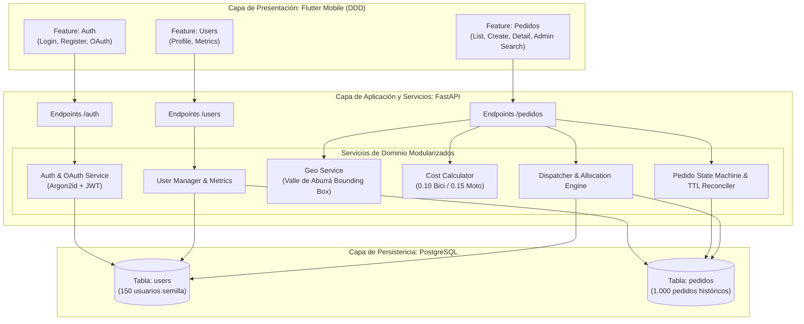
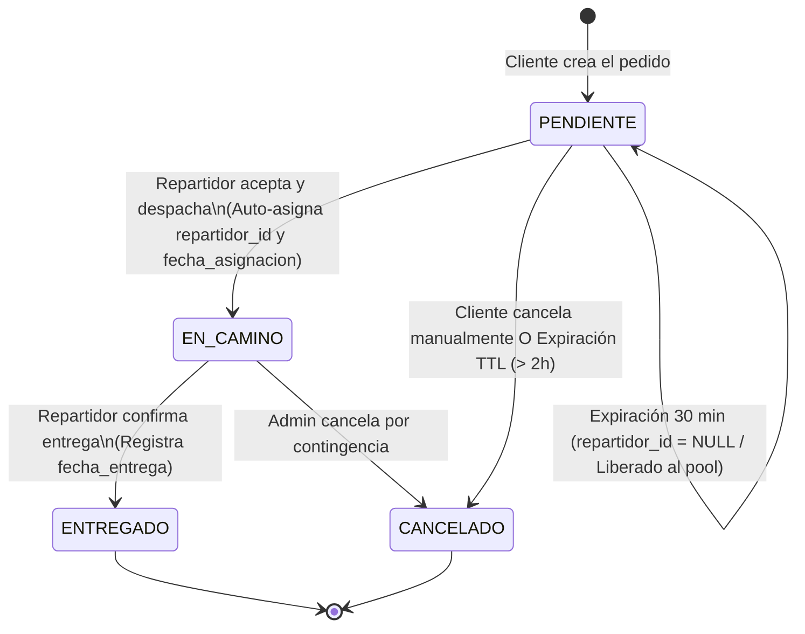
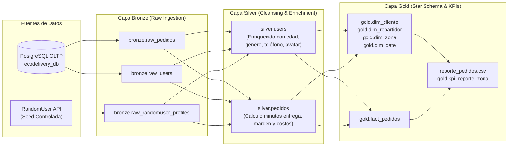

# Documentación Técnica de Features y Arquitectura del Sistema
## EcoDelivery S.A.S. - Plataforma de Logística Sostenible

---

## 1. Resumen Ejecutivo y Arquitectura del Sistema

La plataforma **EcoDelivery** es una solución integral orientada a la gestión logística, analítica de datos y seguimiento en tiempo real de entregas de última milla con vehículos cero emisiones (bicicletas y motos eléctricas) en el Valle de Aburrá.

El sistema implementa una arquitectura desacoplada y orientada al dominio (Domain-Driven Design - DDD) organizada mediante *Vertical Slices* (rebanadas verticales por funcionalidad), garantizando alta cohesión, bajo acoplamiento y escalabilidad.

### Diagrama General de Arquitectura



---

## 2. Feature 1: Autenticación, Sesiones y Seguridad RBAC

### 2.1. Métodos de Autenticación Soportados
1. **Autenticación Local (OAuth2 Password Bearer):**
   * Hashing de contraseñas mediante **Argon2id** (estándar OWASP implementado a través de `pwdlib[argon2]`).
   * Generación y validación de tokens criptográficos **JWT (JSON Web Tokens)** con algoritmo `HS256`, incluyendo `sub` (User ID), `role` y `email`.
2. **Registro de Usuarios In-App:**
   * Creación de cuentas para roles `cliente` y `repartidor`.
   * Auto-login y persistencia de sesión al completar el registro.
3. **Social OAuth (Google y GitHub):**
   * Integración de endpoints `/auth/google/login`, `/auth/google/callback`, `/auth/github/login` y `/auth/github/callback`.
   * Intercambio de código por token de acceso y vinculación o aprovisionamiento automático de cuentas en PostgreSQL.

### 2.2. Aislamiento y Ciclo de Vida de Sesión en Móvil
* **Persistencia Segura:** Almacenamiento local del token en el cliente HTTP compartido.
* **Purga Atómica:** Al iniciar o cerrar sesión, los controladores de estado (`AuthController`, `ProfileController`, `PedidosController`) ejecutan una limpieza total de memoria para evitar la persistencia de datos residuales entre distintos roles.

---

## 3. Feature 2: Gestión de Usuarios y Caracterización de Clientes/Repartidores

### 3.1. Caracterización de Repartidores
Cada repartidor cuenta con atributos operativos que condicionan su asignación:
* **Zona Principal de Operación:** Zona geográfica fija (`Norte`, `Sur`, `Centro`, `Occidente`, `Chapinero`).
* **Tipo de Vehículo Predilecto:** `bicicleta` o `moto_electrica`.

### 3.2. Métricas y Analítica de Usuario (`/users/me/resumen`)
El sistema calcula en tiempo real indicadores específicos según el rol del usuario:
* **Para Clientes:** Total de pedidos realizados, monto total invertido, pedidos completados y promedio de gasto por orden.
* **Para Repartidores:** Total de entregas completadas, tiempo promedio de entrega (en minutos), pedidos actualmente en camino e ingresos generados.

---

## 4. Feature 3: Gestión de Pedidos, Análisis Geoespacial y Modelo Financiero

### 4.1. Delimitación Geoespacial (Valle de Aburrá)
Los pedidos se sitúan geográficamente en coordenadas válidas del departamento de Antioquia, asignando latitud y longitud dentro de los rangos operacionales de cada zona:

| Zona de Entrega | Latitud de Referencia | Longitud de Referencia | Rango Operativo Real |
| :--- | :---: | :---: | :--- |
| **Sur** | 6.1649 | -75.5953 | Envigado, Itagüí, Sabaneta |
| **Occidente** | 6.2566 | -75.6045 | Laureles, San Javier, Belén |
| **Centro** | 6.2502 | -75.5594 | La Candelaria, Prado Centro |
| **Chapinero** | 6.2649 | -75.5497 | Manrique, Aranjuez (Nororiente) |
| **Norte** | 6.2839 | -75.5654 | Castilla, Bello |

### 4.2. Modelo Financiero y Costo Operativo
El costo operativo del despacho se calcula automáticamente en función del valor del pedido y del medio de transporte asignado:

$$\text{Costo Operación} = \begin{cases} \text{monto} \times 0.10 & \text{si el transporte es Bicicleta} \\ \text{monto} \times 0.15 & \text{si el transporte es Moto Eléctrica} \end{cases}$$

---

## 5. Feature 4: Máquina de Estados, Despacho y Reglas de Conciliación TTL

### 5.1. Ciclo de Vida del Pedido



### 5.2. Reglas de Negocio de Conciliación Temporal (TTL)
1. **Regla de 30 Minutos (Liberación a Bolsa Abierta):**  
   Si un pedido en estado `PENDIENTE` asignado a un repartidor no es aceptado en los primeros 30 minutos desde su creación, el sistema remueve la asignación (`repartidor_id = NULL`), poniéndolo a disposición inmediata de cualquier repartidor disponible en la ciudad.
2. **Regla de 2 Horas (Auto-Cancelación por Vencimiento):**  
   Si transcurren 120 minutos (2 horas) sin que ningún repartidor despache la orden, el sistema la transiciona automáticamente a estado `CANCELADO`, evitando órdenes rezagadas en la operación.
3. **Auto-Asignación Garantizada al Despachar:**  
   Cuando un repartidor selecciona *"Aceptar y Despachar"* en un pedido pendiente, el backend vincula obligatoriamente el ID del repartidor autenticado y la marca de tiempo actual (`fecha_asignacion = NOW()`).

---

## 6. Feature 5: Matriz de Control de Acceso por Rol (RBAC)

La siguiente tabla resume los permisos y restricciones implementados tanto en el Backend como en la Interfaz Móvil:

| Operación / Endpoint | Cliente | Repartidor | Administrador | Comportamiento en la App Móvil |
| :--- | :---: | :---: | :---: | :--- |
| **Crear Pedido (`POST /pedidos`)** | Sí | No | Sí | Botón flotante *"Nuevo Pedido"* visible solo para clientes. |
| **Consultar Mis Pedidos (`GET /users/me/pedidos`)** | Sí | Sí | Sí | Pantalla *"Mis Pedidos"* (Cliente) o *"Mis Entregas"* (Repartidor). |
| **Listar Catálogo Global (`GET /pedidos`)** | **Bloqueado (403)** | **Solo Pendientes** | **Acceso Total** | Clientes no tienen pestaña de catálogo; Repartidores ven *"Disponibles en mi Zona"*; Admin cuenta con buscador y paginador. |
| **Ver Detalle Pedido (`GET /pedidos/{id}`)** | Solo propios | Asignados / Pendientes | Acceso Total | Bloqueo de visualización de pedidos ajenos para clientes. |
| **Avanzar a En Camino / Entregado (`PATCH /pedidos/{id}/estado`)** | No | Sí | Sí | Botones *"Aceptar y Despachar"* y *"Confirmar Entrega"* exclusivos para repartidores. |
| **Cancelar Pedido (`PATCH /pedidos/{id}/estado`)** | Solo si es Pendiente | No | Sí | Botón *"Cancelar Pedido"* activo únicamente en estado pendiente. |
| **Búsqueda Global y Paginación** | No | No | Sí | Barra de búsqueda reactiva y paginador exclusivos en la interfaz de Administrador. |

---

## 7. Estructura de Módulos y Código Fuente

### 7.1. Backend (`backend/app/`)
```text
backend/app/
├── api/v1/
│   ├── deps/                # Inyectores de dependencias (Auth JWT, Roles RBAC)
│   └── endpoints/           # Controladores REST (auth, users, pedidos, oauth)
├── core/                    # Configuración, seguridad (Argon2id, JWT) y settings
├── db/                      # Conexión SQLAlchemy y sesiones
├── models/                  # Entidades de base de datos (User, Pedido)
├── schemas/                 # Esquemas Pydantic v2 de validación y respuesta
└── services/                # Capa de Dominio DDD Modularizada
    ├── auth/                # AuthService y OAuthService
    ├── users/               # UserManager y UserMetricsService
    └── pedidos/             # GeoService, CostCalculator, Dispatcher, StateMachine, PedidoReader
```

### 7.2. Frontend Móvil (`app_flutter/lib/`)
```text
app_flutter/lib/
├── core/                    # Constantes de API, Cliente HTTP y Tema Material 3
└── features/                # Rebanadas Verticales de Dominio (Clean DDD)
    ├── auth/
    │   ├── data/            # LocalDatasource, RemoteDatasource, RepositoriesImpl
    │   ├── domain/          # Entities y Repositories (Interfaces)
    │   └── presentation/    # AuthController, LoginScreen, RegisterScreen
    ├── users/
    │   ├── data/            # UserRemoteDatasource, UserRepositoryImpl
    │   ├── domain/          # Entities y UserResumen
    │   └── presentation/    # ProfileController, ProfileScreen, UserStatsCard
    └── pedidos/
        ├── data/            # PedidosRemoteDatasource, PedidosRepositoryImpl
        ├── domain/          # Entities (Pedido, EstadoPedido, Filtros)
        └── presentation/    # PedidosController, PedidosListScreen, CreatePedidoScreen, DetailScreen
```

---

---

## 9. Feature 6: Pipeline de Datos en Apache Airflow (Arquitectura Medallón & Star Schema)

### 9.1. Arquitectura de Datos por Capas (Medallion Pattern)



### 9.2. Reglas de Enriquecimiento y Protección de Datos
1. **Protección Absoluta:** Zonas y coordenadas del Valle de Aburrá (Medellín) y correos electrónicos transaccionales no se sobreescriben.
2. **Enriquecimiento Demográfico:** Inclusión de `gender`, `age`, `age_group` (`18-25`, `26-35`, `36-50`, `50+`), teléfono y URL de avatar.
3. **Métricas de Rúbrica Assessment:**
   * Tiempo promedio de entrega en minutos por zona (solo órdenes entregadas).
   * Conteo de órdenes por estado.
   * Ingresos totales y ticket promedio por zona.
   * Generación y exportación del archivo `reporte_pedidos.csv` para consumo directo en Power BI.

---

## 10. Verificación y Calidad de Código

* **Backend E2E:** 10/10 pruebas automatizadas superadas (`backend/tests/test_live_api.py`).
* **Frontend Flutter:** 0 errores y 0 advertencias de compilación (`dart analyze`).
* **Pipeline Airflow:** DAG `etl_pedidos_diario` estructurado en TaskGroups con tareas idempotentes (UPSERT).
* **Seguridad:** Cumplimiento de estándares de autenticación y autorización por rol en todos los niveles.

