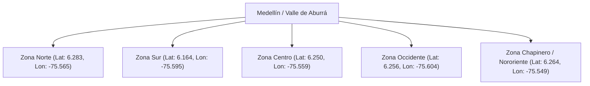
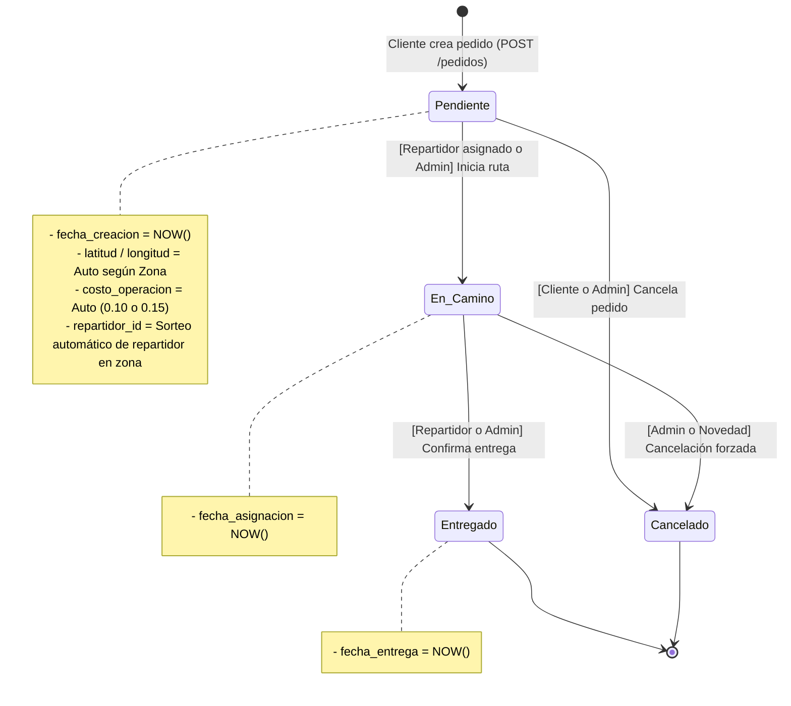
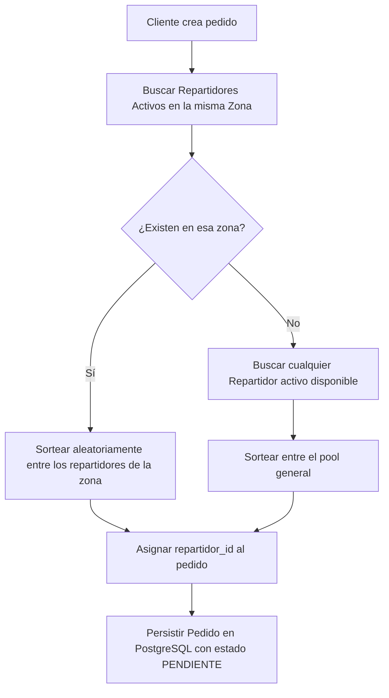

# Documento de Arquitectura, Lógica de Negocio y Decisiones Técnicas
## Sistema de Pedidos y Analítica - EcoDelivery S.A.S.

Este documento formaliza todas las decisiones de arquitectura, reglas de negocio, modelos matemáticos, análisis geoespacial y justificaciones técnicas adoptadas para la solución integral de **EcoDelivery S.A.S.**

---

## 1. Análisis Geoespacial y Confirmación de Coordenadas

### 📍 Hallazgo en los Datos Semilla (`pedidos_db_ready.csv`):
A pesar de que una de las 5 zonas de la prueba se denomina *"Chapinero"* (nombre asociado comúnmente a Bogotá), el análisis empírico de las coordenadas en los 1000 registros históricos demostró que **toda la operación geográfica de EcoDelivery está situada en Medellín y el Valle de Aburrá**:

| Zona de Operación | Latitud Promedio | Longitud Promedio | Rango de Latitudes | Rango de Longitudes | Ubicación Real en el Terreno |
| :--- | :---: | :---: | :---: | :---: | :--- |
| **Sur** | `6.164962` | `-75.595357` | `6.1503` a `6.1794` | `-75.6097` a `-75.5801` | Envigado / Itagüí / Sabaneta |
| **Occidente** | `6.256659` | `-75.604599` | `6.2302` a `6.2798` | `-75.6199` a `-75.5900` | Laureles / San Javier / Belén |
| **Centro** | `6.250269` | `-75.559476` | `6.2402` a `6.2598` | `-75.5699` a `-75.5501` | La Candelaria / Prado |
| **Chapinero** | `6.264949` | `-75.549764` | `6.2600` a `6.2699` | `-75.5598` a `-75.5400` | Manrique / Aranjuez (Nororiente) |
| **Norte** | `6.283953` | `-75.565434` | `6.2700` a `6.2999` | `-75.5797` a `-75.5500` | Castilla / Bello |

> [!IMPORTANT]
> **Decisión Geoespacial:** Se mantendrá la generación automática de coordenadas dentro de estos cuadrantes exactos con una dispersión estocástica de $\pm 0.003^\circ$ (~300 metros) para garantizar consistencia con los datasets consumidos por Airflow y Power BI.

---

## 2. Modelo Financiero y Costo Operativo

El costo operativo de despacho (`costo_operacion`) representa el gasto logístico del delivery (mantenimiento de flota, depreciación de baterías/componentes y compensación base del repartidor):

$$\text{Costo Operación} = \begin{cases} \text{monto} \times 0.10 & \text{si el transporte es Bicicleta} \\ \text{monto} \times 0.15 & \text{si el transporte es Moto Eléctrica} \end{cases}$$

* **Bicicleta (0.10):** Transporte de cero emisiones con menor costo por kilómetro, ideal para distancias cortas y pedidos ligeros.
* **Moto Eléctrica (0.15):** Mayor autonomía y velocidad para pedidos en zonas de mayor pendiente o distancia, con un costo operativo superior por consumo eléctrico y desgaste mecánico.

---

## 3. Máquina de Estados y Matriz de Permisos por Rol

### Matriz de Transiciones y Privilegios:

| Estado Origen | Estado Destino | Rol Permitido | Efecto Secundario en BD |
| :--- | :--- | :--- | :--- |
| **(Nuevo)** | `pendiente` | `cliente`, `admin` | Auto-asigna `repartidor_id`, calcula GPS y `costo_operacion`. |
| `pendiente` | `en_camino` | `repartidor`, `admin` | Registra automáticamente `fecha_asignacion = NOW()`. |
| `en_camino` | `entregado` | `repartidor`, `admin` | Registra automáticamente `fecha_entrega = NOW()`. |
| `pendiente` | `cancelado` | `cliente`, `admin` | Anula el pedido y libera al repartidor asignado. |
| `entregado` | *(Cualquiera)* | *Ninguno (Terminal)* | Error HTTP 400: Pedido finalizado. |
| `cancelado` | *(Cualquiera)* | *Ninguno (Terminal)* | Error HTTP 400: Pedido cancelado. |

---

## 4. Algoritmo de Despacho y Asignación Automática de Repartidores

Cuando un cliente emite una orden de pedido:

---

## 5. Justificación sobre la Tabla de Productos vs Catálogo de Servicios

### Pregunta Evaluada: *¿Debemos crear una tabla `productos` y `detalle_pedidos` para el modo invitado?*

### Decisión Técnica: **No crear tabla relacional de productos; manejar Catálogo de Servicios Ecológicos en Frontend.**

### Argumentación de Ingeniería:
1. **Alineación con el Core del Negocio:**
   - El objetivo de EcoDelivery es una plataforma de **logística y despacho ecológico**, no un e-commerce de retail con gestión de inventarios/SKUs.
   - Los módulos 3 (Airflow) y 4 (Power BI) consumen métricas a nivel de pedido (`monto`, `tiempo_entrega`, `zona`, `tipo_vehiculo`). Agregar tablas intermedias rompería la compatibilidad directa con los datasets semilla.
2. **Experiencia de Usuario (UI/UX):**
   - El modo **Invitado** muestra una pantalla de bienvenida moderna con los servicios ofrecidos (*Entrega Flash en Bicicleta*, *Paquetería en Moto Eléctrica*, *Cobertura en 5 Zonas*), incentivando la conversión al Login/Registro.
   - El usuario autenticado crea pedidos de forma directa y ágil mediante monto y zona.
