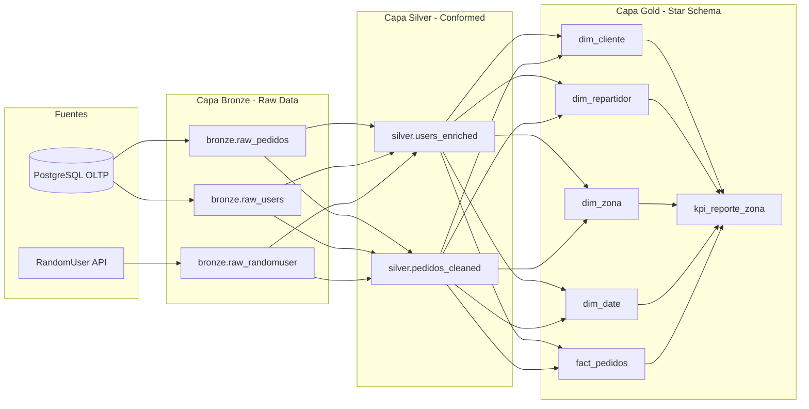

# Documento de Arquitectura, Logica de Negocio y Decisiones Tecnicas
## Sistema de Pedidos y Plataforma Analitica - EcoDelivery S.A.S.

Este documento formaliza las decisiones de arquitectura de datos, reglas de negocio, modelos matematicos, analisis geoespacial y transformaciones de ingenieria implementadas a lo largo de todo el pipeline de EcoDelivery S.A.S.

---

## 1. Analisis Geoespacial y Confirmacion de Coordenadas

### Hallazgo en los Datos Semilla (pedidos_db_ready.csv):
A pesar de que una de las 5 zonas se denomina "Chapinero" (toponimo asociado comunmente a Bogota), el analisis empirico de las coordenadas en los 1000 registros historicos demostro que toda la operacion geografica de EcoDelivery esta situada en Medellin y el Valle de Aburra:

| Zona de Operacion | Latitud Promedio | Longitud Promedio | Rango de Latitudes | Rango de Longitudes | Ubicacion Real en el Terreno |
| :--- | :---: | :---: | :---: | :---: | :--- |
| **Sur** | `6.164962` | `-75.595357` | `6.1503` a `6.1794` | `-75.6097` a `-75.5801` | Envigado / Itagui / Sabaneta |
| **Occidente** | `6.256659` | `-75.604599` | `6.2302` a `6.2798` | `-75.6199` a `-75.5900` | Laureles / San Javier / Belen |
| **Centro** | `6.250269` | `-75.559476` | `6.2402` a `6.2598` | `-75.5699` a `-75.5501` | La Candelaria / Prado |
| **Chapinero** | `6.264949` | `-75.549764` | `6.2600` a `6.2699` | `-75.5598` a `-75.5400` | Manrique / Aranjuez (Nororiente) |
| **Norte** | `6.283953` | `-75.565434` | `6.2700` a `6.2999` | `-75.5797` a `-75.5500` | Castilla / Bello |

---

## 2. Modelo Financiero y Costos Operativos

Para reflejar la realidad del negocio de entregas sostenibles, se diseno un modelo de costos basado en la eficiencia energetica de cada vehiculo:

$$\text{Costo Operacion} = \begin{cases} \text{monto} \times 0.10 & \text{si el transporte es Bicicleta} \\ \text{monto} \times 0.15 & \text{si el transporte es Moto Electrica} \end{cases}$$

$$\text{Margen Bruto} = \text{monto} - \text{Costo Operacion}$$

* **Bicicleta (10% costo):** Modelo de cero emisiones con mantenimiento minimo y menor costo operativo por kilometro.
* **Moto Electrica (15% costo):** Mayor rango y velocidad de despacho con un costo operativo ligeramente superior por consumo y desgaste.

---

## 3. Maquina de Estados y Reglas de Conciliacion Temporal (TTL)

Para garantizar la coherencia transaccional y evitar pedidos huerfanos, se implementaron las siguientes reglas de ciclo de vida:

```mermaid
flowchart TD
    Inicio[Cliente crea Pedido: PENDIENTE] --> Check30{Transcurrieron 30 min sin aceptar?}
    Check30 -- Si --> Liberar[Liberar repartidor_id = NULL\nDisponible para cualquier conductor]
    Check30 -- No --> Mantiene[Mantiene asignacion inicial]
    Liberar --> Check2H{Transcurrieron 2 horas sin despachar?}
    Mantiene --> Check2H
    Check2H -- Si --> AutoCancel[Auto-Cancelar Pedido\nEstado: CANCELADO por expiracion TTL]
    Check2H -- No --> RepartidorAcepta[Repartidor hace clic en Aceptar y Despachar]
    RepartidorAcepta --> EnCamino[Estado: EN_CAMINO\nrepartidor_id = Conductor solicitante\nfecha_asignacion = NOW()]
    EnCamino --> Entregado[Repartidor confirma entrega\nEstado: ENTREGADO\nfecha_entrega = NOW()]
```

---

## 4. Pipeline de Datos Medallon (Apache Airflow 3.0)

El pipeline `etl_pedidos_diario` esta estructurado bajo la Arquitectura Medallon (Bronze -> Silver -> Gold) para garantizar trazabilidad, calidad y disponibilidad analitica de alto rendimiento:



### Capa Bronze (Extraccion e Ingesta Cruda)
* **Objetivo:** Capturar los datos fuente en su estado original sin transformaciones destructivas.
* **Metadatos de Auditoria:** A cada registro se le inyectan automaticamente dos columnas:
  - `_extracted_at`: Marca de tiempo UTC del momento exacto de la extraccion.
  - `_source`: Identificador del origen del dato (`oltp_pedidos_table`, `oltp_users_table`, `randomuser_api`).
* **Resiliencia de API Externa:** Para la API publica de RandomUser, se implemento un mecanismo de fallback con reintentos controlados y timeout para no bloquear el flujo si el servicio externo experimenta latencia.

### Capa Silver (Limpieza, Tipado y Enriquecimiento)
* **Limpieza y Estandarizacion:**
  - Conversion estricta de fechas ISO-8601 a `TIMESTAMP WITH TIME ZONE`.
  - Normalizacion de cadenas de texto (eliminacion de espacios en blanco, estandarizacion de minusculas en correos y estados).
  - Manejo de valores nulos en `repartidor_id` para pedidos en estado `pendiente` o `cancelado`.
* **Calculo de SLA y Tiempos de Entrega:**
  $$\text{tiempo\_entrega\_minutos} = \frac{\text{fecha\_entrega} - \text{fecha\_creacion}}{60 \text{ segundos}}$$
* **Enriquecimiento Demografico con RandomUser:**
  - Se emparejan los usuarios del sistema transaccional con datos demograficos sinteticos enriquecidos: edad, genero, telefono, avatar y grupo etario.
  - **Segmentacion Etaria:**
    - `18-25` (Jovenes / Universitarios)
    - `26-35` (Jovenes Profesionales)
    - `36-50` (Adultos)
    - `50+` (Adultos Mayores)

### Capa Gold (Modelado Dimensional Star Schema y KPIs)
* **Modelo Dimensional Kimball:** Estructurado para optimizar consultas OLAP en Power BI y herramientas de BI:
  - **`dim_cliente`**: Informacion demografica, grupo etario y zona de residencia.
  - **`dim_repartidor`**: Vehiculo predilecto, zona habitual y rendimiento.
  - **`dim_zona`**: Centroides geograficos oficiales del Valle de Aburra (Latitud/Longitud).
  - **`dim_date`**: Tabla de calendario completa con descomposicion de ano, mes, trimestre, dia de la semana y bandera de fin de semana (`is_weekend`).
  - **`fact_pedidos`**: Tabla de hechos con claves subrogadas (`*_sk`), montos, costos, margen y tiempo de entrega.
* **Generacion Automatica de Reportes CSV:**
  - El pipeline consolida la tabla `gold.kpi_reporte_zona` y exporta el archivo `dwh/reports/reporte_pedidos.csv` cumpliendo con todos los KPIs exigidos por la rubrica del assessment.
