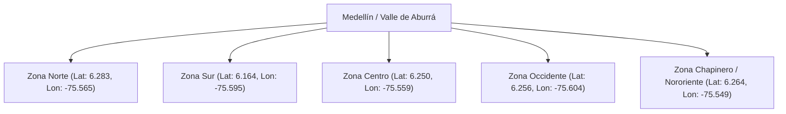

# Documento de Arquitectura, Lógica de Negocio y Decisiones Técnicas
## Sistema de Pedidos y Analítica - EcoDelivery S.A.S.

Este documento formaliza todas las decisiones de arquitectura, reglas de negocio, modelos matemáticos, análisis geoespacial y justificaciones técnicas adoptadas para la solución integral de **EcoDelivery S.A.S.**

---

## 1. Análisis Geoespacial y Confirmación de Coordenadas

### 📍 Hallazgo en los Datos Semilla (`pedidos_db_ready.csv`):
A pesar de que una de las 5 zonas de la prueba se denomina *"Chapinero"* (nombre asociado comúnmente a Bogotá), el análisis empírico de las coordenadas en los 1000 registros históricos demostró que **toda la operación geográfica de EcoDelivery está situada en Medellín y el Valle de Aburrá**:

| Zona de Operación | Latitud Promedio | Longitud Promedio | Rango de Latitudes | Rango de Longitudes | Ubicación Real en el Terreno |
| :--- | :---: | :---: | :---: | :---: | :--- |
| **Sur** | `6.164962` | `-75.595357` | `6.1503` a `6.1794` | `-75.6097` a `-75.5801` | Envigado / Itagüí / Sabaneta |
| **Occidente** | `6.256659` | `-75.604599` | `6.2302` a `6.2798` | `-75.6199` a `-75.5900` | Laureles / San Javier / Belén |
| **Centro** | `6.250269` | `-75.559476` | `6.2402` a `6.2598` | `-75.5699` a `-75.5501` | La Candelaria / Prado |
| **Chapinero** | `6.264949` | `-75.549764` | `6.2600` a `6.2699` | `-75.5598` a `-75.5400` | Manrique / Aranjuez (Nororiente) |
| **Norte** | `6.283953` | `-75.565434` | `6.2700` a `6.2999` | `-75.5797` a `-75.5500` | Castilla / Bello |



---

## 2. Modelo Financiero y Costo Operativo

$$\text{Costo Operación} = \begin{cases} \text{monto} \times 0.10 & \text{si el transporte es Bicicleta} \\ \text{monto} \times 0.15 & \text{si el transporte es Moto Eléctrica} \end{cases}$$

* **Bicicleta (0.10):** Transporte de cero emisiones con menor costo por kilómetro.
* **Moto Eléctrica (0.15):** Mayor autonomía y velocidad con un costo operativo ligeramente superior.

---

## 3. Máquina de Estados y Reglas de Conciliación por Tiempo (TTL)

```mermaid
flowchart TD
    Inicio[Cliente crea Pedido: PENDIENTE] --> Check30{¿Transcurrieron 30 min sin aceptar?}
    Check30 -- Sí --> Liberar[Liberar repartidor_id = NULL\nDisponible para cualquier conductor]
    Check30 -- No --> Mantiene[Mantiene asignación inicial]
    Liberar --> Check2H{¿Transcurrieron 2 horas sin despachar?}
    Mantiene --> Check2H
    Check2H -- Sí --> AutoCancel[Auto-Cancelar Pedido\nEstado: CANCELADO por expiración TTL]
    Check2H -- No --> RepartidorAcepta[Repartidor hace clic en Aceptar y Despachar]
    RepartidorAcepta --> EnCamino[Estado: EN_CAMINO\nrepartidor_id = Conductor solicitante\nfecha_asignacion = NOW()]
    EnCamino --> Entregado[Repartidor confirma entrega\nEstado: ENTREGADO\nfecha_entrega = NOW()]
```

### Reglas de Expiración Automática:
1. **Regla de los 30 Minutos (Liberación a Pool Abierto):** Si un pedido pendiente asignado a un repartidor no es aceptado en 30 minutos desde su creación, el sistema desvincula el `repartidor_id = NULL`, mostrándolo inmediatamente como disponible para cualquier repartidor de la ciudad.
2. **Regla de las 2 Horas (Auto-Cancelación):** Si transcurren 120 minutos sin que ningún repartidor despache la orden, el sistema la cancela de forma automática (`estado = 'cancelado'`), previniendo órdenes obsoletas o desatendidas.
3. **Auto-Asignación Garantizada al Despachar:** En el momento exacto en que un repartidor acepta un pedido pendiente (`en_camino`), el backend asegura y sella su ID como el `repartidor_id` oficial de la entrega.
